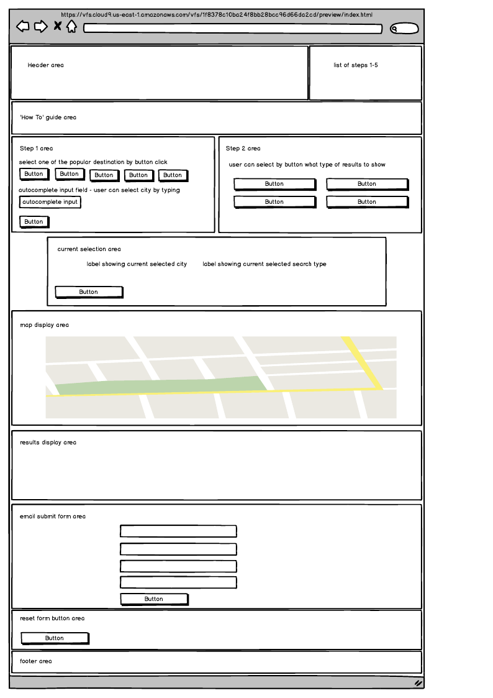
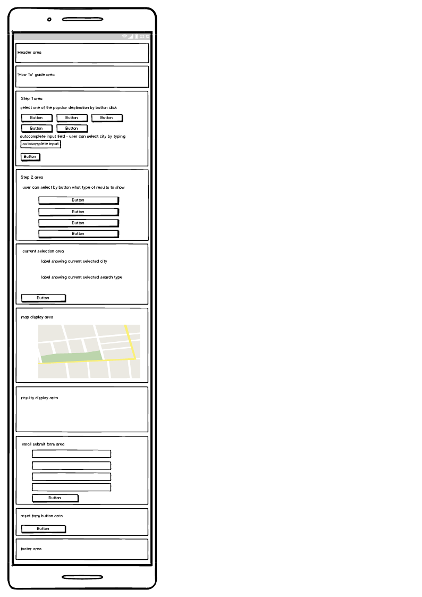
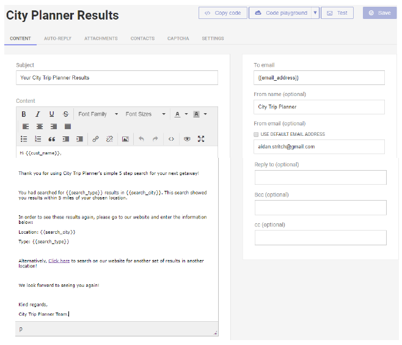

# City Trip Planner
City Trip Planner provides a user with a simple search ability that allows them 
to easily select a city and narrow down the results to show only those that the 
customer is interested in seeing.

Once they have selected their options, the user can view these on a map showing
all results within 5 miles of the map center. They can also view a detailed list
of these results for more information on each result. 

Should they wish to have a record of what they searched for, the user can provide 
an email address and their name, and have the options searched for emailed to them.

In essence, this website allows the user to find results they are actually interested
in and plan their next trip away in 5 easy steps. 

## UX
This project was designed to fulfill the following criteria;
1. Select a destination city
2. Find tourist attractions in the selected city
3. Find accommodation results in the selected city
4. Find nearby bars & restaurants in the selected city
5. Showcase the full list of results in a visually appealing manner
6. Ensure that the website is responsive on all devices

To help the user select their destination city, this website uses two methods;
1. The user can select by clicking a button one of the most popular destinations
2. The user can type into an input field and google autocomplete will prompt them with results based on their input

We have opted to use these two methods as the popular destinations buttons allow
the user to quickly and easily select their destination city while the autocomplete
input allows them to find any other city that they may require. This has been 
labelled as Step 1 so that the user can follow their progress to know which area
is next to complete or view. 

Step 2 lets the user select their search type by clicking on a button. The user 
is provided with 4 options; 
1. Attractions
2. Accommodation
3. Bars & Restaurants
4. All results

Once the user has selected their city and their search type, their chosen options 
are shown in the "current Selection" area so that they are constantly aware of 
which results they will be viewing. 

In order to avoid confusion and to minimise the viewing pane for the user, once
they click on "show" in step 3, the step 1 and step 2 areas will be hidden from 
view. At the same time, the Google map will be shown to the user and will showcase
the results from the search the user has requested based on the chosen options. 

The user can click on the map marker icon to view some basic information on the 
individual result and will be prompted to see the step 4 area for more information. 

In step 4, the user can click on "show" again to hide the map and reveal a list
of the results that contains a summary of the information available such as the
name, rating, address and contact information. This will allow the user to take 
note of any results they may wish to visit on their trip. 

Step 5 allows the user to send a summary of what options had been used for the 
search and prompt them to return to search again for results in their next city 
trip. 

The Desktop view has been kept minimalistic in order to avoid unnecessary noise 
for the user so that they can focus on their city trip search. 

When scaled down, the website remains responsive so that the user can have a good 
UX on any screen size. When viewed on the smallest screen sizes, the website is 
still visually appealing and easy to navigate and use. 

### User Stories
#### New Customers
- As a new customer, I would like to search for bars and restaurants in my area so that I can plan a night out
- As a new customer, I would like to find accommodation options in paris for when I visit this summer
- As a new customer, I would like to find locations in a specific area so that I can plan an upcoming trip
- As a new customer, I would like to search for attractions in a city I plan on visiting this month and make a list of addreses and contact information for them. 
- As a new customer, I would like to send a summary of my search criteria to myself by email so I can keep a record in case I need to search again

#### Returning Customers
- As a returning customer, I would like to go to the email I received and click to go back to the website to have another look at my search results
- As a returning customer, I would like to double check an address for one of the results so that I can make note of it for my trip
- As a returning customer, I would like to check on the map how far my accommodation is from one of the attractions that I want to visit so I can plan my trip better
- As a returning customer, I would like to search for more results in the paris to see if I can get more attractions visited on my upcoming trip
- As a returning customer, I would like to email myself a summary of the search results as I did not do that the first time and would like a record of what criteria I searched for

### Wireframes / Templates
#### Desktop Wireframe

#### Mobile Wireframe

#### Email.js Email Template

## Features
### Existing Features
- 'How To' Section - allows users to quickly see how the website works by reading the 'How To' guide 
- Step 1 Popular City Buttons - allows users to quickly select from one of the most popular locations by having them click on the desired city
- Step 1 Autocomplete City Search Input - allows users to find a specific location to use for their search by typing into the input field, clicking on the desired city and clicking on the "select this city" button
- Step 2 Search Type Buttons - allows users to select what results they would like to see in the chosen city by clicking on the button for the option they desire
- Current Selection Area - allows the user to keep track of what choices they have made by viewing this section
- Reset Search Buttons (in Current Selection area and at bottom of page) - allows the user to quickly and easily reset the website fields so that they can make a new search
- Step 3 Google Map - allows the users to view the results as markers on a Google map by clicking on the "show" button on Step 3 and viewing the map
- Google Map Info Window - allows the user to view more information of a specific result by clicking on the marker icon
- Step 4 Results Area - allows the user to read through the full list of results from their search to see more infomation textually by clicking on the "show" button in Step 4
- Show More Results Button - allows the user to view more results via pagination by clicking on the "more results" button
- Step 5 Email.js Form - allows the user to send themselves an email summary of their search criteria by clicking the "show" button in Step 5, filling in the form and clicking the "send email" button 

### Features Left to Implement
- Full Results List Email- allows the user to choose whether or not to include a full list of the results in the email that they have sent to themselves by clicking on a radio button on the email.js form
- Membership Section - allows the user to create and account so that they can keep track of their searches by having them create an account and logging in
- Save Results - allows the user to save their results so that they can automatically bring up the results by clicking on a save button, saving the code, and entering the code in an input field on their next visit
- Multi-trip Function - allows the user to search for multiple cities and search types and collate the data so that they can plan a trip to more than 1 city at a time for their next city trip plan
- Images of Results - allows the user to view images of the results in step 4 by clicking on a "view images" button and scrolling through an image viewer

## Technologies Used
- HTML - this site uses HTML to instruct the browser how to interprit the code correctly and arrange the layout
- CSS - this site uses CSS to aid in the style, and overall theme of the website
- Bootstrap - this site uses Bootstrap elements to help design the framework of the site
- Balsamiq - this was used to create the wireframes in the design phase
- Email.js - this was used to link the contact form to email.js so that the customer could send the search summary to themselves
- Javascript - this was used to program most of the features on this site
- Jasmine - this was used to test the sites functionality
- JQuery - this was used within the site to aid in visual elements
- FontAwesome - this was used to add images to help make the site more visually appealing

## Testing

#### Responsiveness
#### Bugs Found 
if any

## Deployment

## Credits
### Content
### Media
### Acknowledgements
